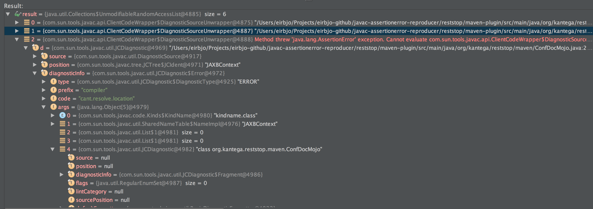

# javac AssertionError reproducer

The reproduce.sh script:

* Downloads maven-compiler-plugin trunk (3.1-SNAPSHOT) and builds it
* Downloads reststop, checks out the j9 branch and builds it

The reststop build should fail in the maven-plugin/ Maven module with an AssertionError in javac:


```
Exception in thread "main" java.lang.AssertionError
	  at jdk.compiler/com.sun.tools.javac.util.Assert.error(Assert.java:155)
	  at jdk.compiler/com.sun.tools.javac.util.Assert.check(Assert.java:46)
	  at jdk.compiler/com.sun.tools.javac.comp.Modules.enter(Modules.java:243)
	  at jdk.compiler/com.sun.tools.javac.main.JavaCompiler.readSourceFile(JavaCompiler.java:841)
	  at jdk.compiler/com.sun.tools.javac.main.JavaCompiler.readSourceFile(JavaCompiler.java:821)
	  at jdk.compiler/com.sun.tools.javac.processing.JavacProcessingEnvironment$ImplicitCompleter.complete(JavacProcessingEnvironment.java:1469)
	  at jdk.compiler/com.sun.tools.javac.code.Symbol.complete(Symbol.java:633)
	  at jdk.compiler/com.sun.tools.javac.code.Symbol$ClassSymbol.complete(Symbol.java:1273)
	  at jdk.compiler/com.sun.tools.javac.code.Type$ClassType.complete(Type.java:1150)
	  at jdk.compiler/com.sun.tools.javac.code.Type$ClassType.getTypeArguments(Type.java:1076)
	  at jdk.compiler/com.sun.tools.javac.code.Printer.visitClassType(Printer.java:237)
	  at jdk.compiler/com.sun.tools.javac.code.Printer.visitClassType(Printer.java:52)
	  at jdk.compiler/com.sun.tools.javac.code.Type$ClassType.accept(Type.java:1003)
	  at jdk.compiler/com.sun.tools.javac.code.Printer.visit(Printer.java:136)
	  at jdk.compiler/com.sun.tools.javac.util.AbstractDiagnosticFormatter.formatArgument(AbstractDiagnosticFormatter.java:197)
	  at jdk.compiler/com.sun.tools.javac.util.AbstractDiagnosticFormatter.formatArguments(AbstractDiagnosticFormatter.java:165)
	  at jdk.compiler/com.sun.tools.javac.util.BasicDiagnosticFormatter.formatMessage(BasicDiagnosticFormatter.java:111)
	  at jdk.compiler/com.sun.tools.javac.util.BasicDiagnosticFormatter.formatMessage(BasicDiagnosticFormatter.java:67)
	  at jdk.compiler/com.sun.tools.javac.util.AbstractDiagnosticFormatter.formatArgument(AbstractDiagnosticFormatter.java:183)
	  at jdk.compiler/com.sun.tools.javac.util.AbstractDiagnosticFormatter.formatArguments(AbstractDiagnosticFormatter.java:165)
	  at jdk.compiler/com.sun.tools.javac.util.BasicDiagnosticFormatter.formatMessage(BasicDiagnosticFormatter.java:111)
	  at jdk.compiler/com.sun.tools.javac.util.BasicDiagnosticFormatter.formatMessage(BasicDiagnosticFormatter.java:67)
	  at jdk.compiler/com.sun.tools.javac.util.JCDiagnostic.getMessage(JCDiagnostic.java:775)
	  at jdk.compiler/com.sun.tools.javac.api.ClientCodeWrapper$DiagnosticSourceUnwrapper.getMessage(ClientCodeWrapper.java:788)
	  at org.codehaus.plexus.compiler.javac.JavaxToolsCompiler.compileInProcess(JavaxToolsCompiler.java:131)
	  at org.codehaus.plexus.compiler.javac.JavacCompiler.performCompile(JavacCompiler.java:174)
	  at org.apache.maven.plugin.compiler.AbstractCompilerMojo.execute(AbstractCompilerMojo.java:943)
	  at org.apache.maven.plugin.compiler.CompilerMojo.execute(CompilerMojo.java:137)
	  at org.apache.maven.plugin.DefaultBuildPluginManager.executeMojo(DefaultBuildPluginManager.java:134)
	  at org.apache.maven.lifecycle.internal.MojoExecutor.execute(MojoExecutor.java:207)
	  at org.apache.maven.lifecycle.internal.MojoExecutor.execute(MojoExecutor.java:153)
	  at org.apache.maven.lifecycle.internal.MojoExecutor.execute(MojoExecutor.java:145)
	  at org.apache.maven.lifecycle.internal.LifecycleModuleBuilder.buildProject(LifecycleModuleBuilder.java:116)
	  at org.apache.maven.lifecycle.internal.LifecycleModuleBuilder.buildProject(LifecycleModuleBuilder.java:80)
	  at org.apache.maven.lifecycle.internal.builder.singlethreaded.SingleThreadedBuilder.build(SingleThreadedBuilder.java:51)
	  at org.apache.maven.lifecycle.internal.LifecycleStarter.execute(LifecycleStarter.java:128)
	  at org.apache.maven.DefaultMaven.doExecute(DefaultMaven.java:307)
	  at org.apache.maven.DefaultMaven.doExecute(DefaultMaven.java:193)
	  at org.apache.maven.DefaultMaven.execute(DefaultMaven.java:106)
	  at org.apache.maven.cli.MavenCli.execute(MavenCli.java:863)
	  at org.apache.maven.cli.MavenCli.doMain(MavenCli.java:288)
	  at org.apache.maven.cli.MavenCli.main(MavenCli.java:199)
	  at java.base/jdk.internal.reflect.NativeMethodAccessorImpl.invoke0(Native Method)
	  at java.base/jdk.internal.reflect.NativeMethodAccessorImpl.invoke(NativeMethodAccessorImpl.java:62)
	  at java.base/jdk.internal.reflect.DelegatingMethodAccessorImpl.invoke(DelegatingMethodAccessorImpl.java:43)
	  at java.base/java.lang.reflect.Method.invoke(Method.java:538)
	  at org.codehaus.plexus.classworlds.launcher.Launcher.launchEnhanced(Launcher.java:289)
	  at org.codehaus.plexus.classworlds.launcher.Launcher.launch(Launcher.java:229)
	  at org.codehaus.plexus.classworlds.launcher.Launcher.mainWithExitCode(Launcher.java:415)
	  at org.codehaus.plexus.classworlds.launcher.Launcher.main(Launcher.java:356)
```

Here's a debugger screenshot showing that there are in total 6 diagnostis, all related to missing java.xml.bind:


